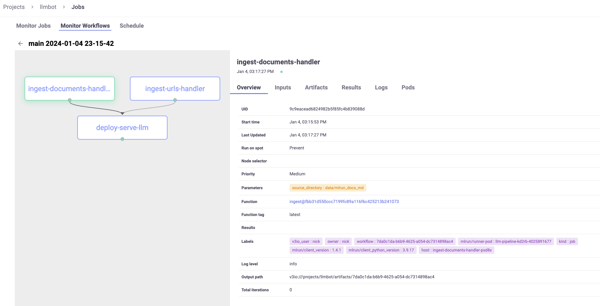
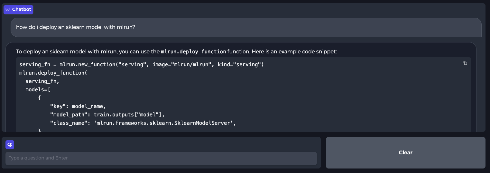

# Interactive Bot Demo using LLMs and MLRun

This repository demonstrates the usage of Language Models (LLMs) and MLRun to build an interactive chatbot using your own data for Retrieval Augmented Question Answering. The data will be ingested and indexed into a Vector Database to be queried by an LLM in real-time.

The project utilizes MLRun for orchestration/deployment, HuggingFace embeddings for indexing data, Milvus for the vector database, OpenAI's GPT-3.5 model for generating responses, Langchain to retrieve relevant data from the vector store and augment the response from the LLM, and Gradio for building an interactive frontend.

- [Getting Started](#getting-started)
    - [Pre-Requisites](#pre-requisites)
    - [Installation](#installation)
- [Overview](#overview)
    - [Index Data and Deploy LLM](#index-data-and-deploy-llm)
    - [Interactive Chat Application](#interactive-chat-application)
- [Adding New Data](#adding-new-data)
    - [Documents](#documents)
    - [URLs](#urls)
    - [CSV File](#csv-file)
    - [SQL Database](#sql-database)

## Getting Started

To get started with the Interactive Bot Demo, follow the instructions below and then see the [tutorial.ipynb](tutorial.ipynb):

### Pre-Requisites

 - `OPENAI_API_KEY`: Obtain an API key from OpenAI to access the GPT-3.5 model. You can find instructions on how to obtain an API key in the [OpenAI docs](https://help.openai.com/en/articles/4936850-where-do-i-find-my-secret-api-key).

### Installation

1. Setup MLRun on Kubernetes using [this documentation](https://docs.mlrun.org/en/latest/install/kubernetes.html)

1. Open Jupyter at http://localhost:30040

1. Clone [this repo](https://github.com/mlrun/demo-llm-bot) inside the Jupyter container

1. This project uses `conda` for environment management. To get started, setup the Python environment using the provided `Makefile`:
    ```bash
    cd demo-llm-bot
    make conda-env
    ```

    *Note: If this command times out, repeat `conda-env` until it successfully installs.*

1. Copy the `mlrun.env` file to another name (e.g. `secrets.env`) and populate with the required environment variables.
    - `OPENAI_API_KEY`: Obtain an API key from OpenAI to access the GPT-3.5 model. You can find instructions on how to obtain an API key in the [OpenAI docs](https://help.openai.com/en/articles/4936850-where-do-i-find-my-secret-api-key).

    - `OPENAI_API_BASE`: If your application uses a different API base than the default, you can specify it here. Otherwise, leave as default.

1. Open [tutorial.ipynb](tutorial.ipynb) in Jupyter with the newly created `llmbot` kernel. Run the notebook to deploy the example.

## Overview

There are two main portions of this project:

### Index Data and Deploy LLM

The first step is to run a pipeline using MLRun responsible for:
1. Ingesting and indexing data into the vector database
1. Deploying a real-time model serving endpoint for the Langchain + Milvus application

This can be done with the following:

```python
import mlrun

project = mlrun.get_or_create_project(
    name="llmbot",
    parameters={
        "source" : "git://github.com/mlrun/demo-llm-bot#main",
        "secrets_file" : "secrets.env",
        "image" : "nschenone/llmbot:1.4.1"
    }
)

project.run(
    name="main",
    arguments={
        "source_directory" : "data/mlrun_docs_md",
        "urls_file" : "data/urls/mlops_blogs.txt"
    },
    watch=True,
    dirty=True
)
```

This results in the following MLRun workflow:


### Interactive Chat Application

Once the data has been indexed and the LLM application is running, the endpoint can be directly queried via POST request like so:

```python
serving_fn = project.get_function("serve-llm", sync=True)
serving_fn.invoke(path="/", body={"question" : "how I deploy ML models?", "chat_history" : []})
```

Additionally, it can be used in the provided interactive chat application. This application will answer questions in a chatbot format using the provided documents as context. The response from the LLM will also specify which document was used to craft the response. It can be deployed locally with the following:

```python
from src import chat

chat.launch(server_name="0.0.0.0", ssl_verify=False)
```


The model endpoint at the top can be filled in using this info:

```python
endpoint_url = serving_fn.get_url()
endpoint_url
```

## Adding New Data

In order to run this demo with your own data, changes can be made in a few different places depending on the type of the data.

### Documents

To ingest your own documents into the vector store, download them locally and place them under the [data](./data) directory in a dedicated sub-directory. Then, update the `source_directory` parameter in the pipeline.

Currently, the supported file types are `.csv`, `.doc`, `.docx`, `.enex`, `.epub`, `.html`, `.md`, `.odt`, `.pdf`, `.ppt`, `.pptx`, and `.txt`. If additional file types are needed, update `LOADER_MAPPING` within [ingestion.py](./src/llmbot/ingestion.py) with the corresponding file extension and document loader.

### URLs

To ingest your own content from URLs into the vector store, create a file modelled after [mlops_blogs.txt](./data/urls/mlops_blogs.txt) where each URL to be ingested is on its own line. Place this file under the [data](./data) directory in a dedicated sub-directory. Then, update the `urls_file` parameter in the pipeline.

### CSV File

CSV files can be used in two different ways. The first is just as a simple document as described [above](#documents). However, you can also interact with the CSV file using a [Langchain CSV Agent](https://python.langchain.com/docs/integrations/toolkits/csv).

To use a CSV Agent, first place your `.csv` file within the [data](./data) directory in a dedicated sub-directory. Then, update the `build_agent` function within [agent.py](./src/llmbot/agent.py) to point to the new CSV file using the provided `build_csv_chain` helper function. 

*Note: It is possible to have multiple CSV Agents. Simply register both as `tools` with a name, description, and newly created chain from `build_csv_chain`.*

### SQL Database

SQLAlchemy compatible databases can be interacted with via the [Langchain SQL Database Agent](https://python.langchain.com/docs/integrations/toolkits/sql_database).

If using a local database such as SQLite, place the `.db` file within the [data](./data) directory in a dedicated sub-directory. Then, update the `build_agent` function within [agent.py](./src/llmbot/agent.py) to point to the local database file or remote SQLAlchemy URI using the provided `build_sql_database_chain` helper function.

*Note: It is possible to have multiple SQL Database Agents. Simply register both as `tools` with a name, description, and newly created chain from `build_sql_database_chain`.*