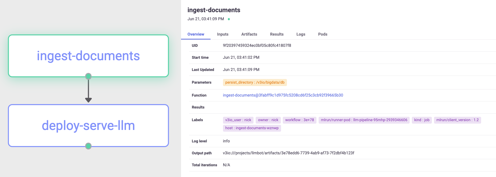
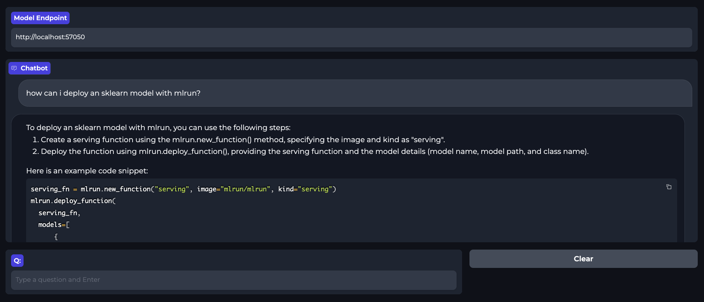

# Interactive Bot Demo using LLMs and MLRun

This repository demonstrates the usage of Language Models (LLMs) and MLRun to build an interactive chatbot using your own data for Retrieval Augmented Question Answering. The data will be ingested and indexed into a Vector Database to be queried by an LLM in real-time.

The project utilizes MLRun for orchestration/deployment, HuggingFace embeddings for indexing data, ChromaDB for the vector database, OpenAI's GPT-3.5 model for generating responses, Langchain to retrieve relevant data from the vector store and augment the response from the LLM, and Gradio for building an interactive frontend.


## Getting Started

To get started with the Interactive Bot Demo, see the [tutorial.ipynb](tutorial.ipynb) or follow the instructions below:

### Prerequisites

Copy the `mlrun.env` file to another name (e.g. `creds.env`) and populate with the required environment variables.

1. `MLRUN_DBPATH`: API Endpoint for the MLRun database service. See [MLRun documentation](https://docs.mlrun.org/en/latest/install/remote.html#install-remote) for more info.

1. `OPENAI_API_KEY`: Obtain an API key from OpenAI to access the GPT-3.5 model. You can find instructions on how to obtain an API key in the [OpenAI docs](https://help.openai.com/en/articles/4936850-where-do-i-find-my-secret-api-key).

1. `OPENAI_API_BASE`: If your application uses a different API base than the default, you can specify it here. Otherwise, leave as default.

### Installation

This project uses `conda` for environment managmeent and `poetry` for dependency management. To get started:

1. Install [Conda](https://docs.conda.io/en/latest/miniconda.html)
1. Set up the environment via `make conda-env`
1. Activate conda environment with `conda activate llmbot`


## Overview

There are two main portions of this project:

### Index Data and Deploy LLM

The first step is to run a pipeline using MLRun responsible for:
1. Ingesting and indexing data into the vector database
1. Deploying a real-time model serving endpoint for the Langchain + ChromaDB application

This can be done with the following:

```python
from src import create_and_set_project

ENV_FILE = "mlrun.env" # update to your .env file

project = create_and_set_project(
    env_file=ENV_FILE,
    git_source="git://github.com/mlrun/demo-llm-bot#main"
)

project.run(
    name="main",
    arguments={"persist_directory" : "/v3io/bigdata/db"},
    watch=True,
    dirty=True
)
```

This results in the following MLRun workflow:


### Interactive Chat Application

Once the data has been indexed and the LLM application is running, the endpoint can be directly queried via POST request like so:

```python
serving_fn = project.get_function("serve-llm")
serving_fn.invoke(path="/", body={"question" : "How tall are llamas?", "chat_history" : []})
```

Additionally, it can be used in the provided interactive chat application. This application will answer questions in a chatbot format using the provided documents as context. The response from the LLM will also specify which document was used to craft the response. It can be deployed locally with the following:

```python
from src import chat

chat.launch(server_name="0.0.0.0", ssl_verify=False)
```


The model endpoint at the top can be filled in using this info:

```python
endpoint_url = f"https://{serving_fn.status.external_invocation_urls[0]}"
endpoint_url
```
